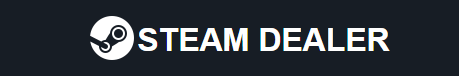

# Equipe 2
Integrantes: Kaio Fernando, Pablo Guilherme, Pablo Lucas, Rafael Araújo, Rafael Martinho.

## Projeto - Steam Dealer

Este projeto consiste em um site desenvolvido com Node.js e Express, utilizando Express Handlebars como template engine, para encontrar os melhores preços de jogos utilizando a API pública do CheapShark.

***

## Índice
- [Desenvolvimento](#desenvolvimento)
- [Estrutura do projeto](#estrutura-do-projeto)
- [Dificuldades](#dificuldades-conhecidas)
- [Tecnologias](#tecnologias)
- [Como utilizar](#como-utilizar)
- [Imagens](#imagens)

***

## Desenvolvimento

O projeto foi desenvolvido com Node.js para o backend e Express para criar o servidor web. O Express Handlebars foi escolhido como a engine de templates para renderizar as páginas HTML. A integração com a API pública do CheapShark foi realizada para buscar informações sobre os preços dos jogos.

***

### API

***

## Estrutura do projeto

- `src/index.js`: O arquivo principal do aplicativo onde o servidor Express é configurado.
- `src/routes.js`: Arquivo de rota que lida com as requisições HTTP.
- `src/views`: Contém os arquivos de template Handlebars.
- `src/assets`: Contém arquivos estáticos como CSS, JavaScript e imagens.

***

## Dificuldades Conhecidas

- **Tratamento de Erros**: O tratamento de erros ao lidar com as respostas da API é crucial para garantir a robustez da aplicação. Certifique-se de implementar adequadamente o tratamento de erros para lidar com situações inesperadas.

***

## Tecnologias

 
  
  
  
  
  
  
  

## Como utilizar

1. Clone esse repositório em sua máquina local
2. Dentro da pasta `src`, instale as bibliotecas necessárias com `npm install`
3. Execute `npm run dev`
4. O site estará rodando localmente na porta 8000 do computador

***

## Imagens

## Contribuições

Contribuições são bem-vindas! Se você identificar algum problema ou tiver sugestões de melhorias, sinta-se à vontade para abrir uma issue ou enviar um pull request.
